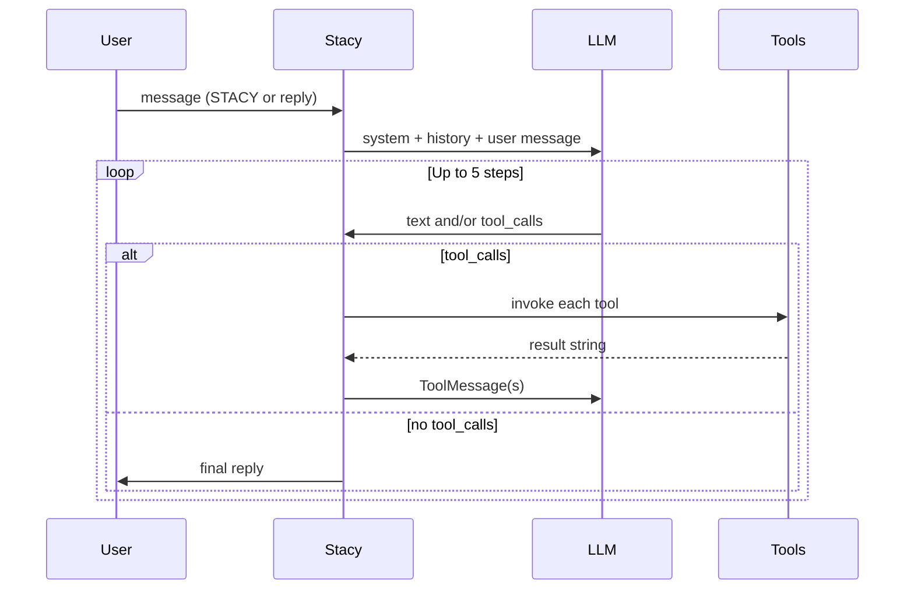

# Stacy Discord Bot

Stacy is a Discord bot powered by **OpenAI** (via [LangChain](https://js.langchain.com/)) and **discord.js**. She answers when you mention her name or reply to one of her messages, plays music in voice channels, remembers recent chat per user in **SQLite**, and uses an **agent loop** so the model can call tools (search the web, ping contacts, manage groups, open PRs, and more) before replying.

Runs in production on a Raspberry Pi (**PiQueen**); see [AGENTS.md](./AGENTS.md) for tmux restart conventions on that host.

## Requirements

- **Node.js** 23+ (uses built-in [`node:sqlite`](https://nodejs.org/api/sqlite.html))
- **pnpm**
- Discord application with bot token, `Message Content` intent, and slash commands registered for your guild

## Quick start

```bash
git clone https://github.com/braydenwerner/stacy-discord-bot.git
cd stacy-discord-bot
pnpm install
# Create .env with the variables below (no .env.example in repo)
pnpm run deployCommands
pnpm run dev
```

Production:

```bash
pnpm run build
pnpm run start
```

## Environment variables

| Variable | Required | Description |
|----------|----------|-------------|
| `TOKEN` | yes | Discord bot token |
| `CLIENT_ID` | yes | Discord application ID |
| `GUILD_ID` | yes | Guild ID for slash command deployment |
| `OPENAI_API_KEY` | yes | OpenAI API key |
| `OPENAI_ORG_ID` | yes | OpenAI organization ID |
| `DATABASE_PATH` | no | SQLite path (default: `./data/stacy.db`) |
| `STACY_OWNER_ID` | no | User ID allowed to manage the nice list (default: breadone) |
| `TAVILY_API_KEY` | no | Preferred web search provider (falls back to DuckDuckGo) |
| `CURSOR_API_KEY` | no | Enables `openPullRequest` (Cursor cloud agent) |
| `GITHUB_TOKEN` | no | Used by the PR queue worker |
| `YOUTUBE_COOKIE` | no | Improves YouTube playback on the Pi |
| `DEBUG_ENABLED` | no | Extra logging |

## Talking to Stacy

Stacy only processes a message when:

1. The author is not a bot, **and**
2. The message contains **`STACY`** (case-insensitive), **or** it is a **reply** to one of Stacy’s messages.

### Tone (nice vs snarky)

| Who | Tone |
|-----|------|
| Users on the **nice list** (`nice_list_users` in SQLite) | Helpful, warm |
| **Everyone else** (default) | Snarky, deliberately unhelpful wording |

- **Default is snarky.** Users are only nice after the bot owner adds them (`/tone nice-add` or `manageToneList` / `nice_add`).
- Music, playlists, and most action tools still run for everyone; tone only affects how Stacy *words* replies.
- The model is instructed never to reveal that tone depends on who is talking.
- On first run with an empty nice list, a small seed set is inserted (see `src/constants/defaultNiceList.ts`).

Recent conversation (last **10** text turns per Discord user) is loaded from SQLite and saved after each reply.

## Personal playlists

Each Discord user has their own playlists in SQLite. **You can only read or change your own** (slash commands and tools always use the message author’s ID).

### Default **Favorites** playlist

- Every user gets an empty **Favorites** playlist the first time they use any playlist feature (`ensureDefaultPlaylist` in `src/db/playlists.ts`).
- It cannot be **deleted** or **renamed** (you can still add/remove/rename tracks inside it).
- Legacy `favorite_songs` rows are migrated into **Favorites** on startup, then the old table is dropped.

### Track shape

Each track has a short **label** (unique within a playlist), a display **title**, optional **artist**, and a saved **url** (http/https). Playback always uses the **URL** so the same source replays reliably.

**Add what's playing:** omit title/url on `add_track` or `/playlist add` — Stacy saves the guild's now-playing track and its URL (e.g. “add this to party” or `/playlist add playlist:party`).

### Playback

- **Chat:** `playSong` with `playlist` and optional `trackName` — random track if `trackName` is omitted.
- **Slash:** `/playlist play playlist:<name> [track:<label>]` — random if `track` is omitted.

Examples:

- `/playlist add playlist:favorites track:hype title:Never Gonna Give You Up artist:Rick Astley`
- `/playlist play playlist:favorites` → random from Favorites
- “Stacy, play chill from my party playlist”

## Music player panel

When a track starts (and when you use queue/lyrics/controls), Stacy posts a **music context panel** in the channel:

- **Reposts instead of editing:** the previous panel message is **deleted** and a **new** one is sent at the bottom of chat so it is not buried in fast channels.
- **Tab row:** Now Playing | Queue | Lyrics (if loaded) — active tab is blurple.
- **Control row:** Pause/Resume | Skip | Dismiss.
- Track URLs are included in message `content` where possible so Discord can show native link previews.

Implementation: `src/utils/music/musicContextPanel.ts`, listeners in `src/utils/music/registerMusicPlayerListeners.ts`.

## Agent loop and tool calls

Chat handling lives in `src/events/messageCreate.ts`. Flow:



### Action vs read tools

| Kind | Examples | Behavior |
|------|----------|----------|
| **Read** | `webSearch`, `fetchPage` | Return text to the model only; loop continues so Stacy can summarize or chain another tool |
| **Action** | Music, `sendMessage`, groups, contacts, playlists, tone, PR | Usually post to Discord themselves; loop **stops** after action-only steps (no extra chatty model pass) |

If an action tool returns `ERROR:` or `PARTIAL:` (see `src/utils/toolResult.ts`), the loop treats it like a read tool so the model can explain or retry.

Tool handlers receive the triggering Discord `message` via LangChain config: `{ configurable: { message } }` (not in the JSON schema sent to the model).

### Tools bound to the model

Registered on `llmWithTools` in `src/utils/useMessageHistory.ts` and invoked from `messageCreate.ts`.

#### Music (anyone in voice)

| Tool | Parameters | What it does |
|------|------------|--------------|
| `playSong` | `songName?`, `artist?`, `url?`, `playlist?`, `trackName?` | Search/play in voice; `playlist` + optional `trackName` plays from saved playlists (random if track omitted) |
| `pauseOrResumeSong` | — | Toggle pause |
| `skipSong` | — | Skip current track |
| `viewSongQueue` | — | Open queue tab on the music panel |
| `lyrics` | `songName?`, `artist?` | Fetch/post lyrics (enables Lyrics tab) |
| `nowPlaying` | — | Open Now Playing tab on the music panel |

#### Messaging (anyone)

| Tool | Parameters | What it does |
|------|------------|--------------|
| `sendMessage` | `names[]`, `text` | `@mention` known **contacts** by name (only when the user explicitly asks to tell/send someone something) |

#### Playlists — **your lists only**

| Tool | `action` values | What it does |
|------|-----------------|--------------|
| `managePlaylists` | `create_playlist`, `delete_playlist`, `rename_playlist`, `list_playlists` | Manage playlist names |
| | `add_track`, `remove_track`, `update_track`, `list_tracks` | Manage tracks inside a playlist (`playlist` + `trackName` + title/URL as needed) |

#### Contacts — **Equality** role

| Tool | Parameters | What it does |
|------|------------|--------------|
| `manageContact` | `action`: `add` \| `remove` \| `update`, `name`, `userId?`, `newName?` | CRUD contacts in SQLite |
| `listContacts` | — | Reply with a contacts embed |

#### User groups — **Equality** role

| Tool | Parameters | What it does |
|------|------------|--------------|
| `createGroup` | `group`, `members[]` | Create group + bulk add (`me` = message author) |
| `manageUserGroup` | `action`: `add` \| `remove` \| `delete`, `group`, `user?` | Single-member add/remove or delete group |
| `listUserGroups` | — | Reply with a groups embed |
| `pingGroup` | `group`, `text` | `@mention` all members of a group |

#### Tone — **bot owner** only (`STACY_OWNER_ID`)

| Tool | Parameters | What it does |
|------|------------|--------------|
| `manageToneList` | `action`: `nice_add` \| `nice_remove` \| `list`, `user?` | Add/remove nice-list users or list embed |

#### Pull requests — **nice list** only

| Tool | Parameters | What it does |
|------|------------|--------------|
| `openPullRequest` | `task` | Enqueue a Cursor agent job to implement a change and open a PR (needs `CURSOR_API_KEY`) |

#### Web — anyone

| Tool | Parameters | What it does |
|------|------------|--------------|
| `webSearch` | `query` | Tavily if `TAVILY_API_KEY` is set, else DuckDuckGo (cached ~10 min) |
| `fetchPage` | `url` | Fetch http(s) page text (SSRF-safe; no private IPs) |

### Tool result prefixes (for the agent)

- `OK: …` — success detail  
- `PARTIAL: …` — partial success (e.g. group create with some unknown names)  
- `ERROR: …` — failure; model may follow up  

## Slash commands

Deploy with `pnpm run deployCommands`.

| Command | Access | Subcommands / notes |
|---------|--------|---------------------|
| `/hello` | Everyone | Join voice and play a short hello clip (if in VC) |
| `/play` | Everyone | Stub (“in progress”) |
| `/playlist` | You only | See table below |
| `/people` | Equality | List contacts (embed) |
| `/contact` | Equality | `add`, `remove`, `update` |
| `/group` | Equality | `create`, `add-member`, `remove-member`, `delete`, `list`, `ping` |
| `/tone` | Bot owner | `nice-add`, `nice-remove`, `snarky-add` (alias for remove), `list` |

**Directory admin** (contacts, groups, `/people`): **Equality** role, Discord **Administrator** or **Manage Server** permission, or bot owner (`STACY_OWNER_ID`).

### `/playlist` subcommands

| Subcommand | Description |
|------------|-------------|
| `create` | New playlist (`name`) |
| `delete` | Delete a playlist (**not** Favorites) |
| `rename` | Rename a playlist (**not** Favorites) |
| `list` | All your playlists + track counts (includes Favorites) |
| `tracks` | List tracks in one playlist |
| `add` | Add track (`playlist`, optional `track` label); omit `title`/`url` to save **now playing** (uses its URL) |
| `remove` | Remove track by label |
| `update` | Change track label or song fields |
| `play` | Play from playlist; **omit `track` for random** |

Replies are **ephemeral** except music playback (panel posts in-channel).

## SQLite

Default database: `data/stacy.db` (gitignored).

| Table | Purpose |
|-------|---------|
| `message_history` | Per-user chat turns for context |
| `token_totals` | Cumulative API token usage |
| `contacts` | Guild-scoped name → Discord user ID |
| `user_groups` / `group_members` | Named ping groups |
| `nice_list_users` | Who gets the nice tone (seeded on first run if empty) |
| `playlists` | Per-user playlist names (`favorites` = default **Favorites**) |
| `playlist_tracks` | Tracks inside each playlist |

Migrations run automatically on startup (`src/db/migrations.ts`). Playlist migration from legacy `favorite_songs` runs once in `initDatabase`.

## Project layout

```
src/
  index.ts              # Client, player, DB init
  commands/             # Slash commands (/playlist, /group, …)
  events/               # messageCreate agent loop, interactions
  tools/                # LangChain DynamicStructuredTool definitions
  db/                   # SQLite access + migrations
  utils/
    music/              # playTrack, context panel, player listeners
    directoryEmbeds.ts  # Embeds for contacts, groups, playlists, nice list
```

## Development on PiQueen

Do not run the bot only in a detached SSH shell when you need console logs on the Pi. Use the **`shared`** tmux session — full steps in [AGENTS.md](./AGENTS.md).

```bash
tmux attach -t shared
cd /home/breadone/server/stacy-discord-bot
git pull
pnpm run dev
```

Expect `Ready event has been fired` in the pane after startup.

## License

See repository defaults; no separate license file at time of writing.
